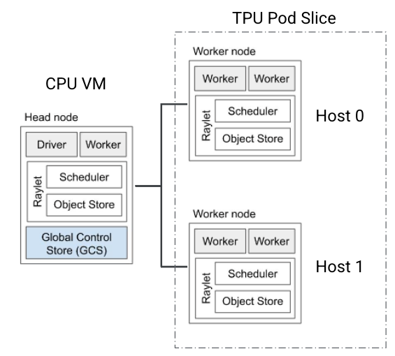

# Using Ray with Cloud TPUs

This **experimental** repository contains a minimal example of how you can use
Ray (ray.io) with Cloud TPUs.

These examples are not meant to be used in production services and are for
illustrative purposes only.

## Helpful pre/post-reads
- [Ray Overview](https://docs.ray.io/en/latest/ray-overview/index.html)
- [Ray Cluster](https://docs.ray.io/en/latest/cluster/vms/getting-started.html#vm-cluster-quick-start)
- [Ray Job](https://docs.ray.io/en/latest/cluster/running-applications/job-submission/index.html)
- [JAX Multi-process programming model](https://jax.readthedocs.io/en/latest/multi_process.html#multi-process-programming-model)

## What's included in this repo?

For your convenience, we provide:
- generic abstractions that hide away boilerplate for common TPU actions and 
- toy examples that you can fork for your own basic workflows.

Specifically:

[`tpu_api.py`](src/tpu_api.py) - Python wrapper for basic TPU operations using the 
[Cloud TPU API](https://cloud.google.com/tpu/docs/reference/rest)

[`tpu_controller.py`](src/tpu_controller.py) - Class representation of a TPU. This
is essentially a wrapper for `tpu_api.py`.

[`ray_tpu_controller.py`](src/tpu_controller.py) - TPU controller with Ray
functionality. This abstracts away boilerplate for Ray Cluster and Ray Jobs.

[`run_basic_jax.py`](src/run_basic_jax.py) - Basic example that shows how to use
`RayTpuController` for `print(jax.device_count())`.

[`run_hp_search.py`](src/run_hp_search.py) - Basic example that shows how Ray
Tune can be used with JAX/Flax on MNIST.

[`run_t5x_autoresume.py`](src/run_t5x_autoresume.py) - Example that showcases how
you can use `RayTpuController` for fault tolerant training using T5X as an
example workload.

## Tutorial

### Setting up your CPU VM
One of the basic ways you can use Ray with a TPU pod is to set up the TPU pod as a ray cluster. We've found that creating a separate CPU VM as an admin (aka coordinator VM) is the natural way to do this. See the below for a visualization
and commands for how you might do this with `gcloud` commands:



```
$ gcloud compute instances create my_tpu_admin --machine-type=n1-standard-4 ...
$ gcloud compute ssh my_tpu_admin

$ (vm) #install Python3, Ray, ...
$ (vm) ray start --head --port=6379 --num-cpus=0
...
# (Ray returns the IP address of the HEAD node, let's call it RAY_HEAD_IP)

$ (vm) gcloud compute tpus tpu-vm create $TPU_NAME ... --metadata startup-script="pip3 install ray && ray start --address=$RAY_HEAD_IP --resources='{\"tpu_host\": 1}'"
```

For your convenience, we also provide basic scripts (see [`create_cpu.sh`](create_cpu.sh) and [`deploy_to_admin.sh`](deploy_to_admin.sh)) for creating
an admin CPU VM and deploying the contents of this folder to your CPU VM.

Notes:
- `create_cpu.sh` will naturally create a VM named `$USER-admin` and will
  utilize whatever project and zone is set to your `gcloud config` defaults.
  Run `gcloud config list` to see what those defaults are.
- `create_cpu.sh` by default allocates a boot disk size of 200GB.
- `deploy_to_admin.sh` assumes your VM name is `$USER-admin` - if you change
  that value in `create_cpu.sh` please be sure to change it in `deploy_to_admin.sh`.

Instructions:

1. Create a CPU admin:
```
$ ./create_cpu.sh
```

Note that this scripts installs dependencies on the VM via
[startup script](https://cloud.google.com/compute/docs/instances/startup-scripts/linux)
and automatically blocks until the startup script is complete.

2. Deploy local code to CPU:
```
$ ./deploy_to_admin.sh
```

3. SSH to the VM
```
$ gcloud compute ssh $USER-admin -- -L8265:localhost:8265
```

Note that we enable port forwarding here as Ray will automatically start a dashboard at port 8265. From the machine that you SSH to your VM, you will be able to access this dashboard at http://127.0.0.1:8265/.

4. Set up your gcloud credentials within the CPU VM:
```
$ gcloud auth login --update-adc
```

5. Run the necessary pip installs:
```
$ pip3 install -r src/requirements.txt
```

6. Start the Ray admin:
```
$ ray start --head --port=6379 --num-cpus=0
```
Note: `--num-cpus=0` will avoid cpu jobs like profiling to be scheduled on the admin node.

### Basic JAX Example
See [`run_basic_jax.py`](src/run_basic_jax.py).

For ML frameworks compatible with Cloud TPUs that use a multi-controller programming model (e.g. JAX and PyTorch/XLA PJRT), you must run at least one process per host (see [Multi-process programming model](https://jax.readthedocs.io/en/latest/multi_process.html#multi-process-programming-model)). The basic way
this looks in practice might be as follows:

```
$ gcloud compute tpus tpu-vm scp my_bug_free_python_code my_tpu:~/ --worker=all
$ gcloud compute tpus tpu-vm ssh my_tpu --worker=all --command="python3 ~/my_bug_free_python_code/main.py"
```

If you have more than ~16 hosts (e.g. v4-128) you will run into SSH scalability issues
and your command might have to change to:
```
$ gcloud compute tpus tpu-vm scp my_bug_free_python_code my_tpu:~/ --worker=all --batch-size=8
$ gcloud compute tpus tpu-vm ssh my_tpu --worker=all --command="python3 ~/my_bug_free_python_code/main.py &" --batch-size=8
```

This can become a hindrance on developer velocity if `my_bug_free_python_code`
contains bugs! One of the ways you can solve this problem is by using an orchestrator like K8s or Ray. Ray includes the concept of a [Runtime environment](https://docs.ray.io/en/latest/ray-core/handling-dependencies.html#runtime-environments) that, when applied, deploys code and dependencies when the Ray application is run.

Combining the Ray Runtime Env with Ray Cluster and Ray Jobs allows us to bypass
the SCP/SSH cycle. [`run_basic_jax.py`](src/run_basic_jax.py) is a minimal example that demonstrates
how you can use the Ray Jobs and Ray runtime environment on a Ray cluster with TPU VMs to run a JAX workload.

Assuming you followed the above examples, you should be able to run this with:
```
$ python3 src/run_basic_jax.py
```

Some example output from this:
```
2023-03-01 22:12:10,065	INFO worker.py:1364 -- Connecting to existing Ray cluster at address: 10.130.0.19:6379...
2023-03-01 22:12:10,072	INFO worker.py:1544 -- Connected to Ray cluster. View the dashboard at http://127.0.0.1:8265 
W0301 22:12:11.148555 140341931026240 ray_tpu_controller.py:143] TPU is not found, create tpu...
Creating TPU:  allencwang-ray-test
Request:  {'accelerator_config': {'topology': '2x2x2', 'type': 'V4'}, 'runtimeVersion': 'tpu-vm-v4-base', 'networkConfig': {'enableExternalIps': True}, 'metadata': {'startup-script': '#! /bin/bash\necho "hello world"\nmkdir -p /dev/shm\nsudo mount -t tmpfs -o size=100g tmpfs /dev/shm\n pip3 install ray[default]\nray start --resources=\'{"tpu_host": 1}\' --address=10.130.0.19:6379'}}
Create TPU operation still running...
Create TPU operation still running...
Create TPU operation complete.
I0301 22:13:17.795493 140341931026240 ray_tpu_controller.py:121] Detected 0 TPU hosts in cluster, expecting 2 hosts in total
I0301 22:13:17.795823 140341931026240 ray_tpu_controller.py:160] Waiting for 30s for TPU hosts to join cluster...
I0301 22:13:47.840997 140341931026240 ray_tpu_controller.py:121] Detected 0 TPU hosts in cluster, expecting 2 hosts in total
I0301 22:13:47.841155 140341931026240 ray_tpu_controller.py:160] Waiting for 30s for TPU hosts to join cluster...
I0301 22:14:17.884582 140341931026240 ray_tpu_controller.py:121] Detected 0 TPU hosts in cluster, expecting 2 hosts in total
I0301 22:14:17.884731 140341931026240 ray_tpu_controller.py:160] Waiting for 30s for TPU hosts to join cluster...
I0301 22:14:47.929018 140341931026240 ray_tpu_controller.py:121] Detected 1 TPU hosts in cluster, expecting 2 hosts in total
I0301 22:14:47.929191 140341931026240 ray_tpu_controller.py:160] Waiting for 30s for TPU hosts to join cluster...
I0301 22:15:17.972458 140341931026240 ray_tpu_controller.py:121] Detected 2 TPU hosts in cluster, expecting 2 hosts in total
I0301 22:15:17.986352 140341931026240 ray_tpu_controller.py:121] Detected 2 TPU hosts in cluster, expecting 2 hosts in total
I0301 22:15:17.986503 140341931026240 ray_tpu_controller.py:90] Ray already started on each host.
2023-03-01 22:15:18,010	INFO dashboard_sdk.py:315 -- Uploading package gcs://_ray_pkg_3599972ae38ce933.zip.
2023-03-01 22:15:18,010	INFO packaging.py:503 -- Creating a file package for local directory '/home/allencwang/src'.
2023-03-01 22:15:18,080	INFO dashboard_sdk.py:362 -- Package gcs://_ray_pkg_3599972ae38ce933.zip already exists, skipping upload.
I0301 22:15:18.455581 140341931026240 ray_tpu_controller.py:169] Queued 2 jobs.
I0301 22:15:18.461539 140341931026240 ray_tpu_controller.py:254] [ADMIN]: raysubmit_yPCPXHiFgaCK2rBY: Status is PENDING
I0301 22:15:18.465895 140341931026240 ray_tpu_controller.py:256] [raysubmit_yPCPXHiFgaCK2rBY]: 
I0301 22:15:18.466022 140341931026240 ray_tpu_controller.py:260] [ADMIN]: Sleeping for 10s.
I0301 22:15:28.479727 140341931026240 ray_tpu_controller.py:254] [ADMIN]: raysubmit_WRUtVB7nMaRTgK39: Status is PENDING
I0301 22:15:28.484131 140341931026240 ray_tpu_controller.py:256] [raysubmit_WRUtVB7nMaRTgK39]: 
I0301 22:15:28.484254 140341931026240 ray_tpu_controller.py:260] [ADMIN]: Sleeping for 10s.
I0301 22:15:38.499749 140341931026240 ray_tpu_controller.py:254] [ADMIN]: raysubmit_yPCPXHiFgaCK2rBY: Status is RUNNING
I0301 22:15:38.509387 140341931026240 ray_tpu_controller.py:256] [raysubmit_yPCPXHiFgaCK2rBY]: E0301 22:15:35.720800499    8561 credentials_generic.cc:35]            Could not get HOME environment variable.

I0301 22:15:38.509567 140341931026240 ray_tpu_controller.py:260] [ADMIN]: Sleeping for 10s.
I0301 22:15:28.479727 140341931026240 ray_tpu_controller.py:254] [ADMIN]: raysubmit_WRUtVB7nMaRTgK39: Status is PENDING
I0301 22:15:28.484131 140341931026240 ray_tpu_controller.py:256] [raysubmit_WRUtVB7nMaRTgK39]: 
I0301 22:15:28.484254 140341931026240 ray_tpu_controller.py:260] [ADMIN]: Sleeping for 10s.
I0301 22:15:38.499749 140341931026240 ray_tpu_controller.py:254] [ADMIN]: raysubmit_yPCPXHiFgaCK2rBY: Status is RUNNING
I0301 22:15:38.509387 140341931026240 ray_tpu_controller.py:256] [raysubmit_yPCPXHiFgaCK2rBY]: E0301 22:15:35.720800499    8561 credentials_generic.cc:35]            Could not get HOME environment variable.

I0301 22:15:38.509567 140341931026240 ray_tpu_controller.py:260] [ADMIN]: Sleeping for 10s.
I0301 22:15:48.523541 140341931026240 ray_tpu_controller.py:254] [ADMIN]: raysubmit_WRUtVB7nMaRTgK39: Status is SUCCEEDED
I0301 22:15:48.561111 140341931026240 ray_tpu_controller.py:256] [raysubmit_WRUtVB7nMaRTgK39]: E0301 22:15:36.294834089   21286 credentials_generic.cc:35]            Could not get HOME environment variable.
8

I0301 22:15:58.575289 140341931026240 ray_tpu_controller.py:254] [ADMIN]: raysubmit_yPCPXHiFgaCK2rBY: Status is SUCCEEDED
I0301 22:15:58.584667 140341931026240 ray_tpu_controller.py:256] [raysubmit_yPCPXHiFgaCK2rBY]: E0301 22:15:35.720800499    8561 credentials_generic.cc:35]            Could not get HOME environment variable.
8

Deleting TPU:  allencwang-ray-test
Delete TPU operation still running...
Delete TPU operation still running...
Delete TPU operation still running...
Delete TPU operation complete.

```

### Fault Tolerant Training
See [`run_pax_autoresume.py`](src/run_pax_autoresume.py).

This example showcases how you can use `RayTpuController` to implement
fault tolerant training. For this example, we pretrain a simple LLM on [PAX](github.com/google/paxml) on a v4-16, but note that you can replace this PAX workload with any other long running workload.

You will need to do a few things:

Clone `paxml` to your admin VM:
```
$ git clone -b paxml-v0.3.0 https://github.com/google/paxml.git
```

To demonstrate the ease-of-use that the Ray Runtime Environment provides for making and deploying JAX changes, this example requires you to modify PAX.

Add a new experiment config:
```
$ cat <<EOT >> paxml/paxml/tasks/lm/params/lm_cloud.py

@experiment_registry.register
class TestModel(LmCloudSpmd2BLimitSteps):
  ICI_MESH_SHAPE = [1, 4, 2]
  CHECKPOINT_POLICY = layers.AutodiffCheckpointType.SAVE_CONTEXT_AND_OUT_PROJ

  def task(self) -> tasks_lib.SingleTask.HParams:
    task_p = super().task()
    task_p.train.num_train_steps = 1000
    task_p.train.save_interval_steps = 100
    return task_p
EOT
```

Then run:
```
$ python3 src/run_pax_autoresume.py
```

As the workload runs, experiment with what happens when you delete your TPU name (by default, named `$USER-tpu-ray`):
```
gcloud compute tpus tpu-vm delete -q $USER-tpu-ray --zone=us-central2-b
```

Ray will detect the TPU is down with following message

```
I0303 05:12:47.384248 140280737294144 checkpointer.py:64] Saving item to gs://yejingxin-us-central2/pax/v4-16-autoresume-test/checkpoints/checkpoint_00000200/metadata.
W0303 05:15:17.707648 140051311609600 ray_tpu_controller.py:127] TPU is not found, create tpu...
2023-03-03 05:15:30,774 WARNING worker.py:1866 -- The node with node id: 9426f44574cce4866be798cfed308f2d3e21ba69487d422872cdd6e3 and address: 10.130.0.113 and node name: 10.130.0.113 has been marked dead because the detector has missed too many heartbeats from it. This can happen when a       (1) raylet crashes unexpectedly (OOM, preempted node, etc.)
        (2) raylet has lagging heartbeats due to slow network or busy workload.
2023-03-03 05:15:33,243 WARNING worker.py:1866 -- The node with node id: 214f5e4656d1ef48f99148ddde46448253fe18672534467ee94b02ba and address: 10.130.0.114 and node name: 10.130.0.114 has been marked dead because the detector has missed too many heartbeats from it. This can happen when a       (1) raylet crashes unexpectedly (OOM, preempted node, etc.)
        (2) raylet has lagging heartbeats due to slow network or busy workload.
```

And the job will automatically recreate the TPU VM and restart the training job
so that it can resume the training from the latest checkpoint (200 step in this
example)

```
I0303 05:22:43.141277 140226398705472 train.py:1149] Training loop starting...
I0303 05:22:43.141381 140226398705472 summary_utils.py:267] Opening SummaryWriter `gs://yejingxin-us-central2/pax/v4-16-autoresume-test/summaries/train`...
I0303 05:22:43.353654 140226398705472 summary_utils.py:267] Opening SummaryWriter `gs://yejingxin-us-central2/pax/v4-16-autoresume-test/summaries/eval_train`...
I0303 05:22:44.008952 140226398705472 py_utils.py:350] Starting sync_global_devices Start training loop from step: 200 across 8 devices globally
```


### HP search
See [`run_hp_search.py`](src/run_hp_search.py).

This example showcases using Ray Tune from the Ray AIR to hyperparameter tune
MNIST from JAX/FLAX.

To run this example, this requires a superset of pip installs:
```
$ pip3 install -r src/requirements-hp.txt
```

Then run:
```
$ python3 src/run_hp_search.py
```

You should see output like this once the script finishes running:
```
Number of trials: 3/3 (3 TERMINATED)
+-----------------------------+------------+-------------------+-----------------+------------+--------+--------+------------------+
| Trial name                  | status     | loc               |   learning_rate |   momentum |    acc |   iter |   total time (s) |
|-----------------------------+------------+-------------------+-----------------+------------+--------+--------+------------------|
| hp_search_mnist_8cbbb_00000 | TERMINATED | 10.130.0.84:21340 |     1.15258e-09 |   0.897988 | 0.0982 |      3 |          82.4525 |
| hp_search_mnist_8cbbb_00001 | TERMINATED | 10.130.0.84:21340 |     0.000219523 |   0.825463 | 0.1009 |      3 |          73.1168 |
| hp_search_mnist_8cbbb_00002 | TERMINATED | 10.130.0.84:21340 |     1.08035e-08 |   0.660416 | 0.098  |      3 |          71.6813 |
+-----------------------------+------------+-------------------+-----------------+------------+--------+--------+------------------+


2023-03-02 21:50:47,378	INFO tune.py:798 -- Total run time: 318.07 seconds (318.01 seconds for the tuning loop).
...
```

## Sharp edges/Troubleshooting

### Ray error messages
If you run a workload that creates/deletes the TPU lifecycle, we notice that sometimes this doesn't disconnect the TPU hosts from the Ray cluster. This may show up as grpc errors that signal that the Ray head node is unable to connect to a set of IP addresses.

 As a result you may need to terminate your ray session (`ray stop`) and restart it (`ray start --head --port=6379 --num-cpus=0`).

### Ray Job Failures
Note: PAX is experimental and this example may break due to pip dependencies. If that happens you may see something like this:
```
I0303 20:50:36.084963 140306486654720 ray_tpu_controller.py:174] Queued 2 jobs.
I0303 20:50:36.136786 140306486654720 ray_tpu_controller.py:238] Requested to clean up 1 stale jobs from previous failures.
I0303 20:50:36.148653 140306486654720 ray_tpu_controller.py:253] Job status: Counter({<JobStatus.FAILED: 'FAILED'>: 2})
I0303 20:51:38.582798 140306486654720 ray_tpu_controller.py:126] Detected 2 TPU hosts in cluster, expecting 2 hosts in total
W0303 20:51:38.589029 140306486654720 ray_tpu_controller.py:196] Detected job raysubmit_8j85YLdHH9pPrmuz FAILED.
2023-03-03 20:51:38,641	INFO dashboard_sdk.py:362 -- Package gcs://_ray_pkg_ae3cacd575e24531.zip already exists, skipping upload.
2023-03-03 20:51:38,706	INFO dashboard_sdk.py:362 -- Package gcs://_ray_pkg_ae3cacd575e24531.zip already exists, skipping upload.
```
To see the root cause of the error, you can go to http://127.0.0.1:8265/ and view the dashboard for the running/failed jobs which will provide more information, e.g.
```
60    INFO: pip is looking at multiple versions of <Python from Requires-Python> to determine which version is compatible with other requirements. This could take a while.
61    INFO: pip is looking at multiple versions of orbax to determine which version is compatible with other requirements. This could take a while.
62    ERROR: Cannot install paxml because these package versions have conflicting dependencies.
63
64    The conflict is caused by:
65        praxis 0.3.0 depends on t5x
66        praxis 0.2.1 depends on t5x
67        praxis 0.2.0 depends on t5x
68        praxis 0.1 depends on t5x
69
70    To fix this you could try to:
71    1. loosen the range of package versions you've specified
72    2. remove package versions to allow pip attempt to solve the dependency conflict
73
74    ERROR: ResolutionImpossible: for help visit https://pip.pypa.io/en/latest/topics/dependency-resolution/#dealing-with-dependency-conflicts
```
