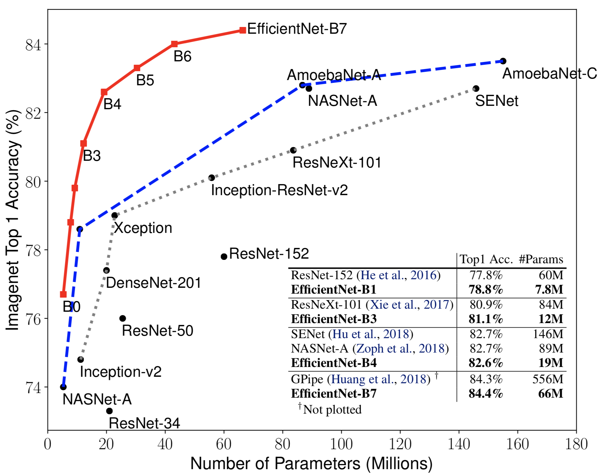

# EfficientNets

[1] Mingxing Tan and Quoc V. Le.  EfficientNet: Rethinking Model Scaling for Convolutional Neural Networks. ICML 2019.

## 1. About EfficientNet Models

EfficientNets is a family of SOTA classification models based on AutoML and Compound Scaling. In particular, we first use [AutoML Mobile framework](https://ai.googleblog.com/2018/08/mnasnet-towards-automating-design-of.html) to develop a mobile-size baseline network, named as EfficientNet-B0; Then, we use the compound scaling method to scale up this baseline to obtain EfficientNet-B1 to B7.

EfficientNets achieve state-of-the-art accuracy on ImageNet with an order of magnitude better efficiency:

{width="406"}
{width="400"}

* In high-accuracy regime, our EfficientNet-B7 achieves state-of-the-art 84.4% top-1 / 97.1% top-5 accuracy on ImageNet, while being 8.4x smaller and 6.1x faster on CPU inference than previous best [Gpipe](https://arxiv.org/abs/1811.06965)

* In middle-accuracy regime, our EfficientNet-B1 is 7.6x smaller and 5.7x faster on CPU inference than [ResNet-152](https://arxiv.org/abs/1512.03385), with similar ImageNet accuracy.

* Compared with the widely used [ResNet-50](https://arxiv.org/abs/1512.03385), our EfficientNet-B4 improves the top-1 accuracy from 76.3% of ResNet-50 to 82.6% with similar FLOPS.

## 2. Using Pretrained EfficientNet Checkpoints

We have provided a list of EfficientNet checkpoints.  Please refer to this colab on how to obtain and use those checkpoints.

## 3. Training EfficientNets on TPUs.

To train this model on Cloud TPU, you will need:

   * A GCE VM instance with an associated Cloud TPU resource
   * A GCS bucket to store your training checkpoints (the "model directory")
   * Install TensorFlow version >= 1.13 for both GCE VM and Cloud.

Then train the model:

    $ export PYTHONPATH="$PYTHONPATH:/path/to/models"
    $ python main.py --tpu=TPU_NAME --data_dir=DATA_DIR --model_dir=MODEL_DIR

    # TPU_NAME is the name of the TPU node, the same name that appears when you run gcloud compute tpus list, or ctpu ls.
    # MODEL_DIR is a GCS location (a URL starting with gs:// where both the GCE VM and the associated Cloud TPU have write access
    # DATA_DIR is a GCS location to which both the GCE VM and associated Cloud TPU have read access.

For more instructions, please refer to our tutorial: https://cloud.google.com/tpu/docs/tutorials/mnasnet
