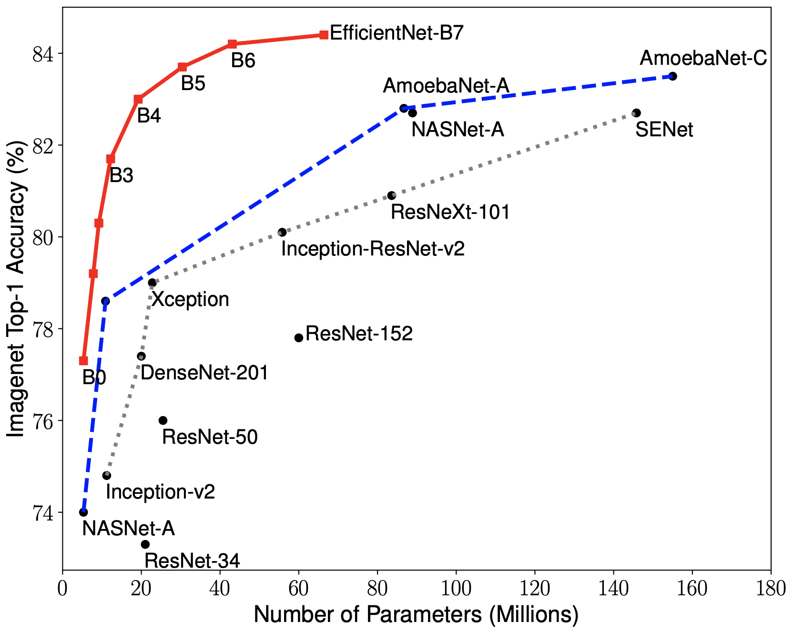
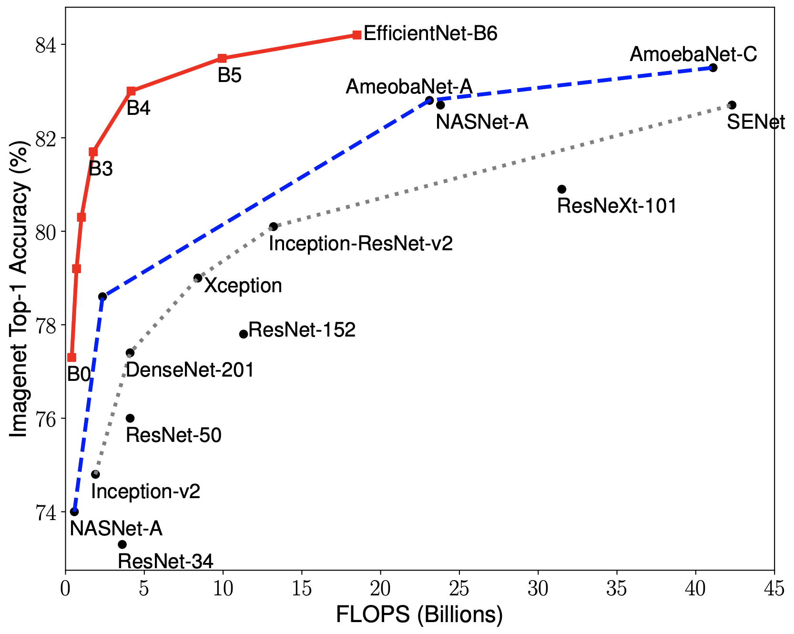

# EfficientNets

[1] Mingxing Tan and Quoc V. Le.  EfficientNet: Rethinking Model Scaling for Convolutional Neural Networks. ICML 2019.
   Arxiv link: https://arxiv.org/abs/1905.11946.

## 1. About EfficientNet Models

EfficientNets are a family of image classification models, which achieve state-of-the-art accuracy, yet being an order-of-magnitude smaller and faster than previous models.

We develop EfficientNets based on AutoML and Compound Scaling. In particular, we first use [AutoML Mobile framework](https://ai.googleblog.com/2018/08/mnasnet-towards-automating-design-of.html) to develop a mobile-size baseline network, named as EfficientNet-B0; Then, we use the compound scaling method to scale up this baseline to obtain EfficientNet-B1 to B7.

<table border="0">
<tr>
    <td>
    
    </td>
    <td>
    
    </td>
</tr>
</table>

EfficientNets achieve state-of-the-art accuracy on ImageNet with an order of magnitude better efficiency:

* In high-accuracy regime, our EfficientNet-B7 achieves state-of-the-art 84.4% top-1 / 97.1% top-5 accuracy on ImageNet with 66M parameters and 37B FLOPS, being 8.4x smaller and 6.1x faster on CPU inference than previous best [Gpipe](https://arxiv.org/abs/1811.06965).

* In middle-accuracy regime, our EfficientNet-B1 is 7.6x smaller and 5.7x faster on CPU inference than [ResNet-152](https://arxiv.org/abs/1512.03385), with similar ImageNet accuracy.

* Compared with the widely used [ResNet-50](https://arxiv.org/abs/1512.03385), our EfficientNet-B4 improves the top-1 accuracy from 76.3% of ResNet-50 to 82.6% (+6.3%), under similar FLOPS constraint.

## 2. Using Pretrained EfficientNet Checkpoints

We have provided a list of EfficientNet checkpoints for [EfficientNet-B0](https://storage.googleapis.com/cloud-tpu-checkpoints/efficientnet/efficientnet-b0.tar.gz), [EfficientNet-B1](https://storage.googleapis.com/cloud-tpu-checkpoints/efficientnet/efficientnet-b1.tar.gz), [EfficientNet-B2](https://storage.googleapis.com/cloud-tpu-checkpoints/efficientnet/efficientnet-b2.tar.gz), and [EfficientNet-B3](https://storage.googleapis.com/cloud-tpu-checkpoints/efficientnet/efficientnet-b3.tar.gz). A quick way to use these checkpoints is to run:

    $ export MODEL=efficientnet-b0
    $ wget https://storage.googleapis.com/cloud-tpu-checkpoints/efficientnet/${MODEL}.tar.gz
    $ tar zxf ${MODEL}.tar.gz
    $ wget https://upload.wikimedia.org/wikipedia/commons/f/fe/Giant_Panda_in_Beijing_Zoo_1.JPG -O panda.jpg
    $ wget https://storage.googleapis.com/cloud-tpu-checkpoints/efficientnet/eval_data/labels_map.txt
    $ python eval_ckpt_main.py --model_name=$MODEL --ckpt_dir=$MODEL --example_img=panda.jpg --labels_map_file=labels_map.txt

Please refer to the following colab for more instructions on how to obtain and use those checkpoints.

  * [`eval_ckpt_example.ipynb`](eval_ckpt_example.ipynb): A colab example to load
 EfficientNet pretrained checkpoints files and use the restored model to classify images.

## 3. Training EfficientNets on TPUs.

To train this model on Cloud TPU, you will need:

   * A GCE VM instance with an associated Cloud TPU resource
   * A GCS bucket to store your training checkpoints (the "model directory")
   * Install TensorFlow version >= 1.13 for both GCE VM and Cloud.

Then train the model:

    $ export PYTHONPATH="$PYTHONPATH:/path/to/models"
    $ python main.py --tpu=TPU_NAME --data_dir=DATA_DIR --model_dir=MODEL_DIR

    # TPU_NAME is the name of the TPU node, the same name that appears when you run gcloud compute tpus list, or ctpu ls.
    # MODEL_DIR is a GCS location (a URL starting with gs:// where both the GCE VM and the associated Cloud TPU have write access
    # DATA_DIR is a GCS location to which both the GCE VM and associated Cloud TPU have read access.

For more instructions, please refer to our tutorial: https://cloud.google.com/tpu/docs/tutorials/efficientnet
