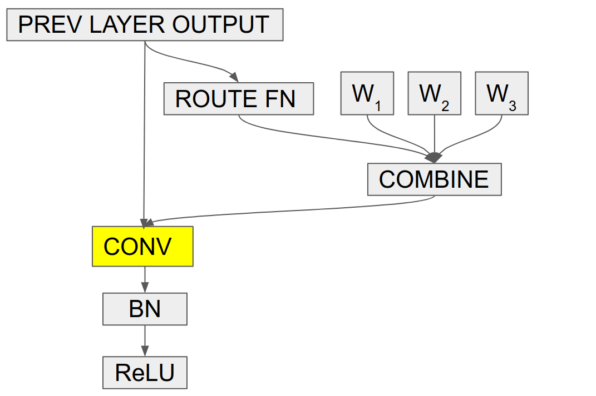

# EfficientNet-CondConv

[1] Brandon Yang, Gabriel Bender, Quoc V. Le, Jiquan Ngiam. CondConv: Conditionally Parameterized Convolutions for Efficient Inference. NeurIPS 2019. Arxiv Link: https://arxiv.org/abs/1904.04971.

## 1. About CondConv

Conditionally parameterized convolutions (CondConv) are a new building block for convolutional neural networks to increase network capacity while maintaining efficient inference measured in multiply-adds (MADDs). In a traditional convolutional layer, each example is processed with the same convolutional kernel. In a CondConv layer, each example is processed with a specialized, example-dependent convolutional kernel. As an intuitive example, on the ImageNet classification dataset, we might want to classify dog breeds and cat breeds with different convolutional kernels.

<table border="0" width="70%">
<tr>
    <td>
    
    </td>
</tr>
</table>

A CondConv layer consists of n experts, each of which are the same size as the convolutional kernel of the original convolutional layer. For each example, this convolutional kernel is computed as a weighted sum of experts with an example-dependent routing function. Increasing the number of experts enables us to increase the size and capacity of a network, while maintaining efficient inference.

Replacing convolutional layers with CondConv layers improves performance, measured by accuracy versus inference cost (MADDs), on a wide range of models: MobileNetV1, MobileNetV2, ResNet, and EfficientNets. When applied to EfficientNets, we obtain EfficientNet-CondConv models, which achieve state-of-the-art performance.

In this directory, we open-source the code to reproduce the EfficientNet-CondConv results and experiment with EfficientNet-CondConv models. Additionally, we open-source the CondConv2d and DepthwiseCondConv2D Keras layers for easy experimentation in new model architectures.
