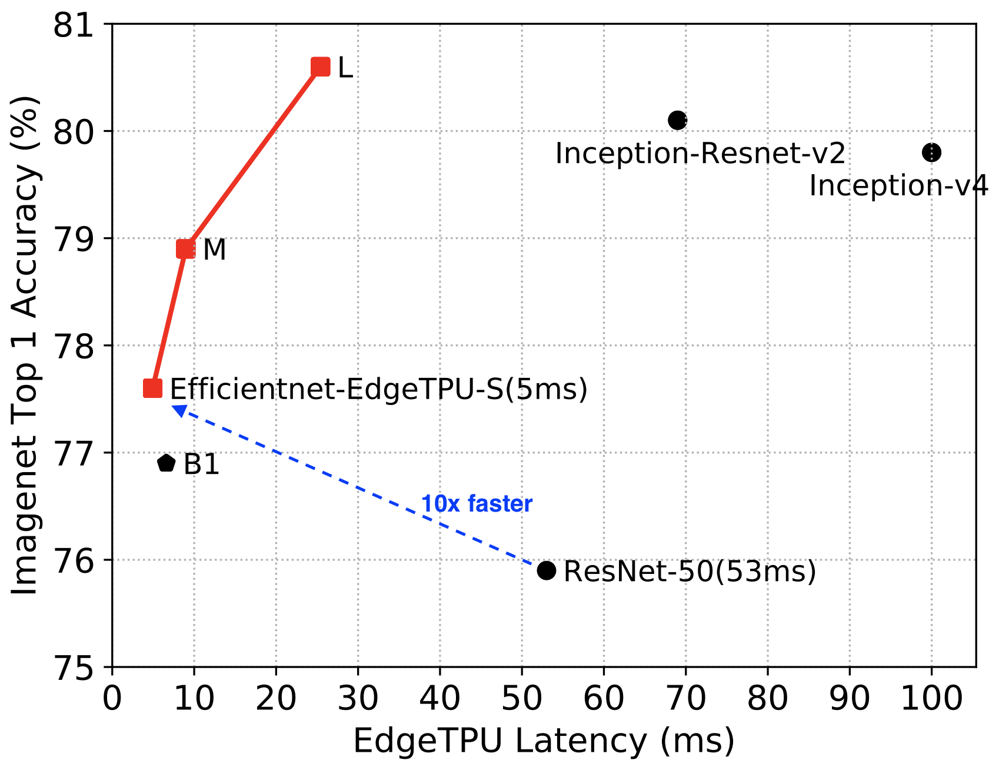

# EfficientNet-EdgeTPU

**Blog post: https://ai.googleblog.com/2019/08/efficientnet-edgetpu-creating.html**

EfficientNet-EdgeTPU are a family of image classification neural network models customized for deployment on [Google Edge TPU](https://coral.withgoogle.com/). These networks are closely related to [EfficientNets] (https://arxiv.org/abs/1905.11946).

EfficientNet-EdgeTPU were developed using the [AutoML MNAS framework](https://ai.googleblog.com/2018/08/mnasnet-towards-automating-design-of.html) by augmenting the neural network search space with building blocks tuned to execute efficiently on the EdgeTPU neural network accelerator architecture. The neural architecture search was incentivized to discover models that achieve low parameter footprint and low latency on EdgeTpu, while simultaneously achieving high classification accuracy. This neural architecture search produced a baseline model: edgetpunet-S, which is subsequently scaled up using EfficientNet's compound scaling method to produce the M and L models.

<table border="0" width="70%">
<tr>
    <td>
    
    </td>
</tr>
</table>

### Using Pretrained EfficientNet-EdgeTPU Checkpoints
We have provided pretrained checkpoints and float/quantized TFLite models:

* [EfficientNet-EdgeTPU-S](https://storage.googleapis.com/cloud-tpu-checkpoints/efficientnet/efficientnet-edgetpu-S.tar.gz)
* [EfficientNet-EdgeTPU-M](https://storage.googleapis.com/cloud-tpu-checkpoints/efficientnet/efficientnet-edgetpu-M.tar.gz)
* [EfficientNet-EdgeTPU-L](https://storage.googleapis.com/cloud-tpu-checkpoints/efficientnet/efficientnet-edgetpu-L.tar.gz)

A quick way to use these checkpoints is to run:

```shell
$ export MODEL=efficientnet-edgetpu-S
$ wget https://storage.googleapis.com/cloud-tpu-checkpoints/efficientnet/${MODEL}.tar.gz
$ tar zxf ${MODEL}.tar.gz
$ wget https://upload.wikimedia.org/wikipedia/commons/f/fe/Giant_Panda_in_Beijing_Zoo_1.JPG -O panda.jpg
$ wget https://storage.googleapis.com/cloud-tpu-checkpoints/efficientnet/eval_data/labels_map.txt
$ python eval_ckpt_main.py --model_name=$MODEL --ckpt_dir=$MODEL --example_img=panda.jpg --labels_map_file=labels_map.txt --include_background_label
```

Note that these models were trained with label#0 marked as the background label for easier deployment. TFLite models can be evaluated using this [tool](https://github.com/tensorflow/tensorflow/tree/master/tensorflow/lite/tools/evaluation/tasks/imagenet_image_classification).

### Training EfficientNet-EdgeTPU on Cloud TPUs
Please refer to our tutorial: https://cloud.google.com/tpu/docs/tutorials/efficientnet

### Post-training quantization

EdgeTPUs support inference using integer quantized models only. We found that using the [Tensorflow Lite's post-training quantization tool](https://www.tensorflow.org/lite/performance/post_training_quantization) works remarkably well for producing a EdgeTPU-compatible quantized model from a floating-point training checkpoint. For full integer quantization, the post-training quantization tool requires a representative dataset for calibrating the dynamic ranges of the activations.

We provide a tool that invokes the post-training quantization tool to produce quantized tensorflow-lite model:

```shell
$ export MODEL=efficientnet-edgetpu-S
$ wget https://storage.googleapis.com/cloud-tpu-checkpoints/efficientnet/${MODEL}.tar.gz
$ tar zxf ${MODEL}.tar.gz
$ python export_model.py --model_name=$MODEL --ckpt_dir=$MODEL --data_dir=/path/to/representative_dataset/ --output_tflite=${MODEL}_quant.tflite
```

To produce a float model that bypasses the post-training quantization:

```shell
$ python export_model.py --model_name=$MODEL --ckpt_dir=$MODEL --output_tflite=${MODEL}_float.tflite --quantize=False
```
The table below compared the accuracy of float models (on CPU) and the quantized models on EdgeTPU:

|**Model** | **Imagenet top-1 accuracy (float)** | **Imagenet top-1 accuracy (quantized)** |
|------|----------------------|------------------|
|efficientnet-edgetpu-S| 77.23% | 77.0 % |
|efficientnet-edgetpu-M| 78.69 | 78.6 % |
|efficientnet-edgetpu-L| 80.62 | 80.2% |

The `export_model.py` script can also be used to export a [tensorflow saved_model](https://www.tensorflow.org/guide/saved_model]) from a training checkpoint:

```shell
$ python export_model.py --model_name=$MODEL --ckpt_dir=/path/to/model-ckpt/ --output_saved_model_dir=/path/to/output_saved_model/ --output_tflite=${MODEL}_float.tflite --quantize=False
```
