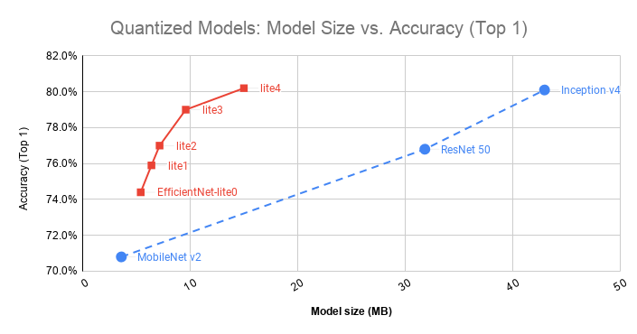
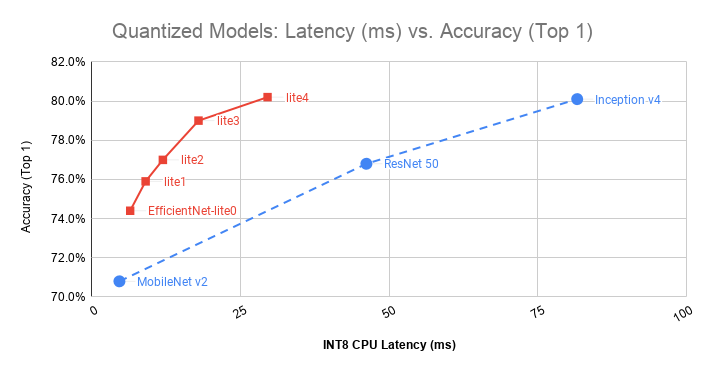
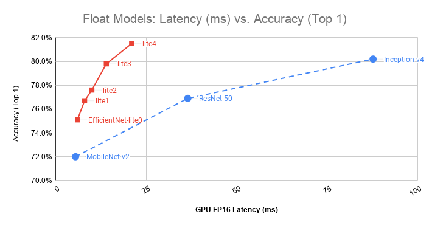

# EfficientNet-lite

EfficientNet-lite are a set of mobile/IoT friendly image classification models. Notably, while EfficientNet-EdgeTPU that is specialized for Coral EdgeTPU, these EfficientNet-lite models run well on all mobile CPU/GPU/EdgeTPU.

Due to the requirements from edge devices, we mainly made the following changes based on the original EfficientNets.

* Remove squeeze-and-excite (SE): SE are not well supported for some mobile accelerators.
* Replace all swish with RELU6: for easier post-quantization.
* Fix the stem and head while scaling models up: for keeping models small and fast.


Here are the checkpoints, and their accurracy, params, flops, and Pixel4's CPU/GPU/EdgeTPU latency.

|**Model** | **params** | **MAdds** | **FP32 accuracy** | **FP32 CPU  latency** | **FP32 GPU latency** | **FP16 GPU latency** |**INT8 accuracy** | **INT8 CPU latency**  | **INT8 TPU latency**|
|------|-----|-------|-------|-------|-------|-------|-------|-------|-------|
|efficientnet-lite0 [ckpt](https://storage.googleapis.com/cloud-tpu-checkpoints/efficientnet/lite/efficientnet-lite0.tar.gz) | 4.7M | 407M |  75.1% |  12ms | 9.0ms | 6.0ms  | 74.4% |  6.5ms | 3.8ms |
|efficientnet-lite1 [ckpt](https://storage.googleapis.com/cloud-tpu-checkpoints/efficientnet/lite/efficientnet-lite1.tar.gz) | 5.4M | 631M |  76.7% |  18ms | 12ms | 8.0ms  |  75.9% | 9.1ms | 5.4ms |
|efficientnet-lite2 [ckpt](https://storage.googleapis.com/cloud-tpu-checkpoints/efficientnet/lite/efficientnet-lite2.tar.gz) | 6.1M | 899M |  77.6% |  26ms | 16ms | 10ms | 77.0% | 12ms | 7.9ms |
|efficientnet-lite3 [ckpt](https://storage.googleapis.com/cloud-tpu-checkpoints/efficientnet/lite/efficientnet-lite3.tar.gz) | 8.2M | 1.44B |  79.8% |  41ms | 23ms | 14ms  | 79.0% | 18ms | 9.7ms |
|efficientnet-lite4 [ckpt](https://storage.googleapis.com/cloud-tpu-checkpoints/efficientnet/lite/efficientnet-lite4.tar.gz) |13.0M | 2.64B |  81.5% |  76ms | 36ms | 21ms  | 80.2% | 30ms | - |

* CPU/GPU/TPU latency are measured on Pixel4, with batch size 1 and 4 CPU threads. FP16 GPU latency is measured with default latency, while FP32 GPU latency is measured with additional option --gpu_precision_loss_allowed=false.

* Each checkpoint all contains FP tflite and post-training quantized INT8 tflite files. If you use these models or checkpoints, you can cite this [efficientnet paper](https://arxiv.org/abs/1905.11946).

Comparing with MobileNetV2, ResNet-50, and Inception-V4, our models have
better trade-offs between accuracy and size/latency.
The following two figures show the comparison among quantized versions of
these models. The latency numbers are obtained on a Pixel 4 with 4 CPU
threads.

<p align="center">
    
</p>

<p align="center">
    
</p>

As Tensorflow Lite also provides GPU acceleration for float models, the
following shows the latency comparison among float versions of these
models. Again, the latency numbers are obtained on a Pixel 4.
<p align="center">
    
</p>

A quick way to use these checkpoints is to run:

```shell
$ export MODEL=efficientnet-lite0
$ wget https://storage.googleapis.com/cloud-tpu-checkpoints/efficientnet/${MODEL}.tar.gz
$ tar zxf ${MODEL}.tar.gz
$ wget https://upload.wikimedia.org/wikipedia/commons/f/fe/Giant_Panda_in_Beijing_Zoo_1.JPG -O panda.jpg
$ wget https://storage.googleapis.com/cloud-tpu-checkpoints/efficientnet/eval_data/labels_map.txt
$ python eval_ckpt_main.py --model_name=$MODEL --ckpt_dir=$MODEL --example_img=panda.jpg --labels_map_file=labels_map.txt
```

TFLite models can be evaluated using this [tool](https://github.com/tensorflow/tensorflow/tree/master/tensorflow/lite/tools/evaluation/tasks/imagenet_image_classification).

### Training EfficientNet-lite on Cloud TPUs
Please refer to our tutorial: https://cloud.google.com/tpu/docs/tutorials/efficientnet

### Post-training quantization


```shell
$ export MODEL=efficientnet-lite0
$ wget https://storage.googleapis.com/cloud-tpu-checkpoints/efficientnet/${MODEL}.tar.gz
$ tar zxf ${MODEL}.tar.gz
$ python export_model.py --model_name=$MODEL --ckpt_dir=$MODEL --data_dir=/path/to/representative_dataset/ --output_tflite=${MODEL}_quant.tflite
```

To produce a float model that bypasses the post-training quantization:

```shell
$ python export_model.py --model_name=$MODEL --ckpt_dir=$MODEL --output_tflite=${MODEL}_float.tflite --quantize=False
```

The `export_model.py` script can also be used to export a [tensorflow saved_model](https://www.tensorflow.org/guide/saved_model) from a training checkpoint:

```shell
$ python export_model.py --model_name=$MODEL --ckpt_dir=/path/to/model-ckpt/ --output_saved_model_dir=/path/to/output_saved_model/ --output_tflite=${MODEL}_float.tflite --quantize=False
```
