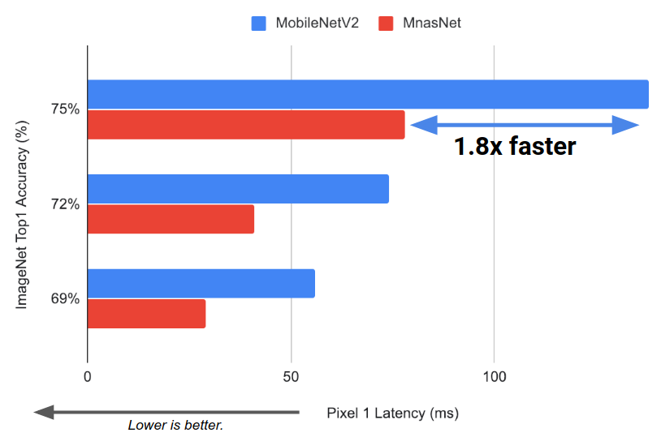
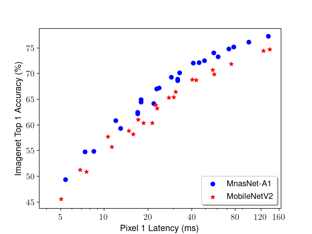

# MNasNet on TPU

## About the model and training regime

References: [MnasNet: Platform-Aware Neural Architecture Search for Mobile](https://arxiv.org/pdf/1807.11626.pdf) by Mingxing Tan, et. al.

We provide a few standard-size and small-size AutoML models in [`mnasnet_models.py`](mnasnet_models.py) including:

  * <b>mnasnet-a1</b> has ~75.2% top-1 ImageNet accuracy  with 3.9M parameters and 312M Multiply-Adds.
  * <b>mnasnet-small</b> has ~66% top-1 ImageNet accuracy with 2.0M parameters and 68M Multiply-Adds.

The standard size MnasNet-A1 inference has 1.8x faster throughput (55% lower latency) than the
corresponding MobileNetV2 model.



Comparing to [MobileNetV2](https://arxiv.org/pdf/1801.04381.pdf),
MnasNet-A1 model has clear better performance in accuracy when they are at the
same latency level.




Here are the details of Mnasnet-A1 on ImageNet:

Input Size	| Depth Multiplier	| Top-1 Accuracy | 	Top-5 Accuracy	| Parameters(M)	| Multi-Adds (M)	| Pixel 1 latency (ms)
------- | ---------| --------- |---------|----|------------- | ----
224 |	1.4	| 77.2	| 93.5 |	6.1	|  591.5	| 135| 	77.2
224 |	1	  | 75.2	| 92.5 |	3.9	|  315.2	| 78	| 75.2
224 |	0.75| 73.3	| 91.3 |	2.9	|  226.7	| 61	| 73.3
224 |	0.5	| 68.9	| 88.4 |	2.1	|  105.2	| 32	| 68.9
224 |	0.35| 64.1	| 85.1 |	1.7	|  63.2	 |  22| 	64.1
192 |	1.4	| 76.1	| 93.0 |	6.1	|  435.1	| 99	| 76.1
192 |	1	  | 74.0	| 91.6 |	3.9	|  232.0	| 57	| 74
192 |	0.75| 72.1	| 90.5 |	2.9	|  166.9	| 45	| 72.1
192 |	0.5	| 67.2	| 87.4 |	2.1	|  77.6	 |  24| 	67.2
192 |	0.35| 62.4	| 83.8 |	1.7	|  46.8	 |  17| 	62.4
160 |	1.4	| 74.8	| 92.1 |	6.1	|  302.8	| 72	| 74.8
160 |	1	  | 72.0	| 90.5 |	3.9	|  161.6	| 41	| 72
160 |	0.75| 70.1	| 89.3 |	2.9	|  116.4	| 33	| 70.1
160 |	0.5	| 64.9	| 85.8 |	2.1	|  54.4	 |  18| 	64.9
160 |	0.35| 52.3	| 81.5 |	1.7	|  32.9	 |  13| 	59.3
128 |	1.4	| 72.5	| 90.6 |	6.1	|  194.5	| 49	| 72.5
128 |	1	  | 69.3	| 88.9 |	3.9	|  104.1	| 29	| 69.3
128 |	0.75| 67.0	| 87.3 |	2.9	|  75.0	 |  23| 	67
128 |	0.5	| 60.8	| 83.0 |	2.1	|  35.3	 |  12| 	60.8
128 |	0.35| 54.8	| 78.1 |	1.7	|  21.6	 |  8.5|	54.8
96	 |1.4	| 68.6	| 88.1 |  6.1	|  110.3	| 32	| 68.6
96	 |1	  | 64.4	| 85.8 |  3.9	|  59.3	 |  18| 	64.4
96	 |0.75| 62.1	| 84.0 |  2.9	|  42.9	 |  17| 	62.1
96	 |0.5	| 54.7	| 78.1 |  2.1	|  20.5	 |  7.4 | 54.7
96	 |0.35| 49.3	| 73.4 |	1.7	|  12.7	  | 5.4| 	49.3


## Cloud TPU Prerequisites

### Setup a Google Cloud project

Follow the instructions at the [Quickstart Guide][quickstart-guide] to get a GCE
VM with access to a Cloud TPU.

[quickstart-guide]: https://cloud.google.com/tpu/docs/quickstart

To run this model, you will need:

* A GCE VM instance with an associated Cloud TPU resource
* A GCS bucket to store your training checkpoints (the "model directory")
* (Optional): The ImageNet training and validation data preprocessed into
  TFRecord format, and stored in GCS.

**Please make sure your TensorFlow version >= 1.13 for both GCE VM and Cloud TPU.**

### Formatting the data

The data is expected to be formatted in TFRecord format, as generated by [this
script][imagenet-download-format-as-tfrecord].

If you do not have ImageNet dataset prepared, you can use a randomly generated
fake dataset to test the model. It is located at
`gs://cloud-tpu-test-datasets/fake_imagenet`.

[imagenet-download-format-as-tfrecord]: https://github.com/tensorflow/tpu/blob/master/tools/datasets/imagenet_to_gcs.py

## Training the model

Add the top-level `/models` folder to the Python path with the command

```
export PYTHONPATH="$PYTHONPATH:/path/to/models"
```

Train the model by executing the following command (substituting the appropriate
values):

```
python mnasnet_main.py \
  --tpu=$TPU_NAME \
  --data_dir=$DATA_DIR \
  --model_dir=$MODEL_DIR
```

`$TPU_NAME` is the name of the TPU node, the same name that appears when you
run `gcloud compute tpus list`, or `ctpu ls`.  (When using the shell
created by `ctpu up`, this argument may not be necessary.)

`$MODEL_DIR` is a GCS location (a URL starting with `gs://` where both the GCE
VM and the associated Cloud TPU have write access, something like `gs://userid-
dev-imagenet-output/model`.  (TensorFlow can't create the bucket; you have to
create it with `gsutil mb <bucket>`.)  This bucket is used to save checkpoints
and the training result, so that the training steps are cumulative when you
reuse the model directory.  If you do 1000 steps, for example, and you reuse the
model directory, on a subsequent run, it will skip the first 1000 steps, because
it picks up where it left off.

`$DATA_DIR` is a GCS location to which both the GCE VM and associated Cloud TPU
have read access, something like `gs://cloud-tpu-test-datasets/fake_imagenet`.
This location is expected to contain files with the prefixes `train-*` and
`validation-*`.  The former pattern is used to match files used for the training
phase, the latter for the evaluation phase.

The training and validation data can also be sourced from Cloud Bigtable:

```
python mnasnet_main.py \
  --tpu=$TPU_NAME \
  --model_dir=$MODEL_DIR \
  --bigtable_project=$PROJECT \
  --bigtable_instance=$INSTANCE \
  --bigtable_table=$TABLE
```

In this case, the `TFExample` records are stored one per row in a Cloud Bigtable
table. Categories of data are arranged by row prefix, and the rows within that
prefix arranged by zero-filled indexes, e.g. `train_0000003892`.)

Note that even when sourcing input data from Cloud Bigtable, `$MODEL_DIR` must
still be a GCS location.

### Project and Zone

If you are not running this script on a GCE VM in the same project and zone as
your Cloud TPU, you will need to add the `--project` and `--zone` flags
specifying the corresponding values for the Cloud TPU you'd like to use.

This will train a Mnasnet model on ImageNet with 1024 batch size on a single
Cloud TPU. With the default flags on everything, the model should train to
above 75% accuracy for MnasNet-A1 model.

You can launch TensorBoard (e.g. `tensorboard -logdir=$MODEL_DIR`) to view loss
curves and other metadata regarding your training run.

> Note: if you launch TensorBoard on your GCE VM, be sure to configure either
> [SSH port forwarding][ssh-port-fwd] or [SOCKS proxy over SSH][socks-proxy] to
> connect to your GCE VM **securely (recommended)**.
>
> Alternatively, you can modify your GCE firewall rules to open a port, but this
> is **not recommended** as it enables **insecure** world-wide access for
> everyone.

[ssh-port-fwd]: https://cloud.google.com/solutions/connecting-securely#port-forwarding-over-ssh
[socks-proxy]: https://cloud.google.com/solutions/connecting-securely#socks-proxy-over-ssh


## Understanding the code

For more detailed information, read the documentation within each file.

* [`imagenet_input.py`](imagenet_input.py): Constructs the `tf.data.Dataset`
  input pipeline which handles parsing, preprocessing, shuffling, and batching
  the data samples.
* [`mnasnet_main.py`](mnasnet_main.py): Main code which constructs the
  TPUEstimator and handles training and evaluating the model.
* [`mnasnet_model.py`](mnasnet_model.py): Modeling library which constructs the
  network via modular MnasBlock.
* [`mnasnet_models.py`](mnasnet_models.py): A script that defines benchmark
MnasNet architectures (e.g. MnasNet-A1, MnasNet-small) through decoding string
representation of the network.
* [`preprocessing.py`](preprocessing.py): Useful utilities for
  preprocessing and augmenting ImageNet data for MnasNet training.
* [`mnasnet_example.ipynb`](mnasnet_example.ipynb): A colab example to load
 MnasNet saved model files and use it to classify images.

## Additional notes

### Serve the exported model in TFLite

The export function of MnasNet trainer will always export TFLite float model
when the '--export_dir' is specified. Furthermore, once '--post_quantize=True'
is set, the trainer will also export a quantized TFLite model using the latest
model checkpoint.

### Using different MnasNet configurations

The default MnasNet models have been carefully tested with the default
flags but [`mnasnet_model.py`](mnasnet_model.py) offers a generic MnasNetBlock
implementation. Thus, user is able to define model configuration through the
string annotation in [`mnasnet_models.py`](mnasnet_models.py) to define new
models. Meanwhile, '--depth_multiplier', '--depth_divisor', '--min_depth' are
flags offered to adjust MnasNet model to different sizes quickly.
