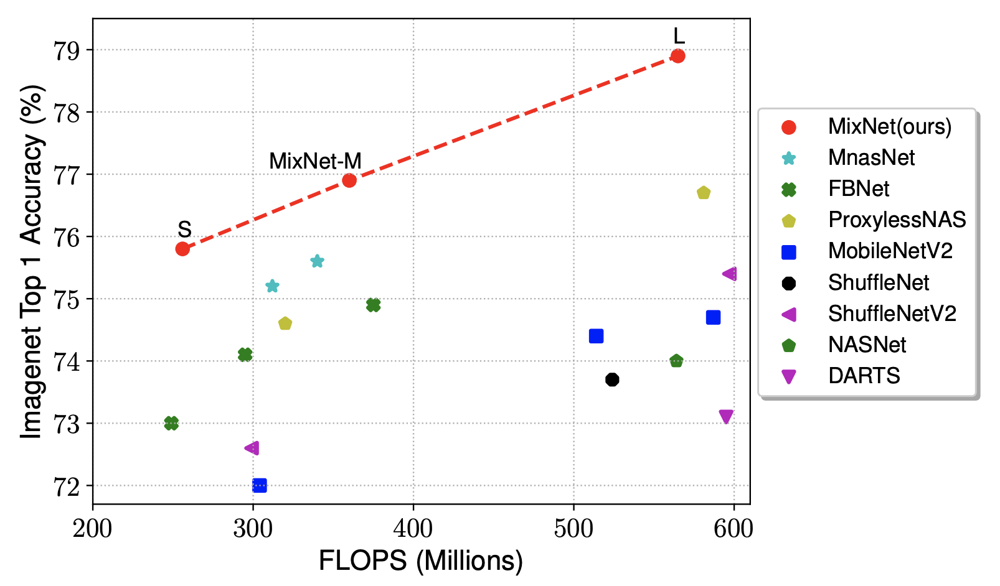

# MixNet

[1] Mingxing Tan and Quoc V. Le.  MixConv: Mixed Depthwise Convolutional Kernels.
   BMVC 2019. https://arxiv.org/abs/1907.09595

## 1. About MixNet

MixNets are a family of mobile-sizes image classification models equipped with MixConv, a new type of mixed depthwise convolutions. They are developed based on [AutoML MNAS Mobile framework](https://ai.googleblog.com/2018/08/mnasnet-towards-automating-design-of.html), with an extended search space including MixConv. Currently, MixNets achieve better accuracy and efficiency than previous mobile models. In particular, our MixNet-L achieves a new state-of-the-art 78.9% ImageNet top-1 accuracy under typical mobile FLOPS (<600M) constraint:

<table border="0", width="75%", align="center">
<tr>
    <td>
    
    </td>
</tr>
</table>

## 2. Using Pretrained Checkpoints

We have provided a list of EfficientNet checkpoints for [MixNet-S](https://storage.googleapis.com/cloud-tpu-checkpoints/mixnet/mixnet-s.tar.gz), [MixNet-M](https://storage.googleapis.com/cloud-tpu-checkpoints/mixnet/mixnet-m.tar.gz), and [MixNet-L](https://storage.googleapis.com/cloud-tpu-checkpoints/mixnet/mixnet-l.tar.gz). A quick way to use these checkpoints is to run:

    $ export MODEL=mixnet-s
    $ wget https://storage.googleapis.com/cloud-tpu-checkpoints/mixnet/${MODEL}.tar.gz
    $ tar zxf ${MODEL}.tar.gz
    $ wget https://upload.wikimedia.org/wikipedia/commons/f/fe/Giant_Panda_in_Beijing_Zoo_1.JPG -O panda.jpg
    $ wget https://storage.googleapis.com/cloud-tpu-checkpoints/efficientnet/eval_data/labels_map.txt
    $ python eval_ckpt_main.py --model_name=$MODEL --ckpt_dir=$MODEL --example_img=panda.jpg --labels_map_file=labels_map.txt

Please refer to the following colab for more instructions on how to obtain and use those checkpoints.

  * [`mixnet_eval_example.ipynb`](mixnet_eval_example.ipynb): A colab example to load
 pretrained checkpoints files and use the restored model to classify images.

## 3. Training and Evaluating MixNets.

MixNets are trained using the same hyper parameters as MnasNet, except specifying different model_name=mixnet-s/m/l.

For more instructions, please refer to the MnasNet tutorial: https://cloud.google.com/tpu/docs/tutorials/mnasnet
